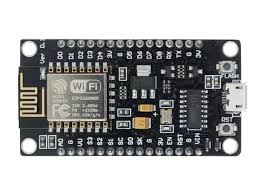

# ESP_DeAuther
<p align="left">
  <a></a>
 </p>
<p align="center">
  
</p>

<p align="center">
  Tool to DeAuthentication attack using Esp8266 module
</p>
<p align="center">
  [ BY: Flyzone | Instagram: HIDED !!!!| v1.0 ]
</p>

<p align="center">
  <a href="https://github.com/DarkSyntax7"></a>
  <a href="https://github.com/DarkSyntax7">.svg" ></a>
  <a href="https://github.com/DarkSyntax7"></a>
  <a href=""></a>
  <a href="https://github.com/DarkSyntax7"></a>
</p>

  ## DISCLAIMER
  
  <p align="center">
  TO BE USED FOR EDUCATIONAL PURPOSES ONLY
</p>

The use of the Wifi-Jammer is **COMPLETE
RESPONSIBILITY of the END-USER**. Developers assume NO liability and are NOT
responsible for any misuse or damage caused by this program. Also we inform you
that some of your your actions may be **ILLEGAL** and you **CAN NOT** use this
software to test person or company without **WRITTEN PERMISSION** from them.


# Installation :

## Clone

```
git clone https://github.com/Flyzone84/DeAuther.git
```
## Running
- Dependencies will be automatically installed.
```
sudo bash wifi-jammer.sh
```
# Demonstration
https://youtu.be/faL-VvP2Kvc

# Contact:

- Instagram:HIDED !!!!
- Github:https://github.com/Flyzone84
